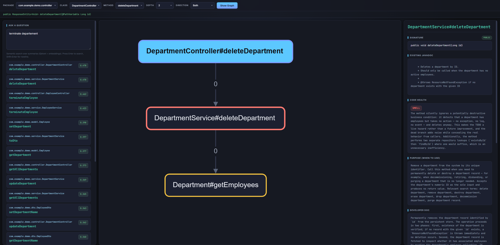
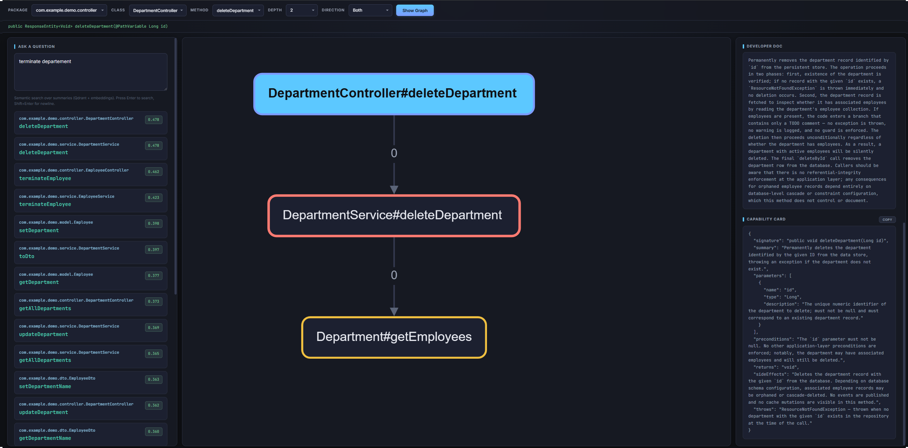
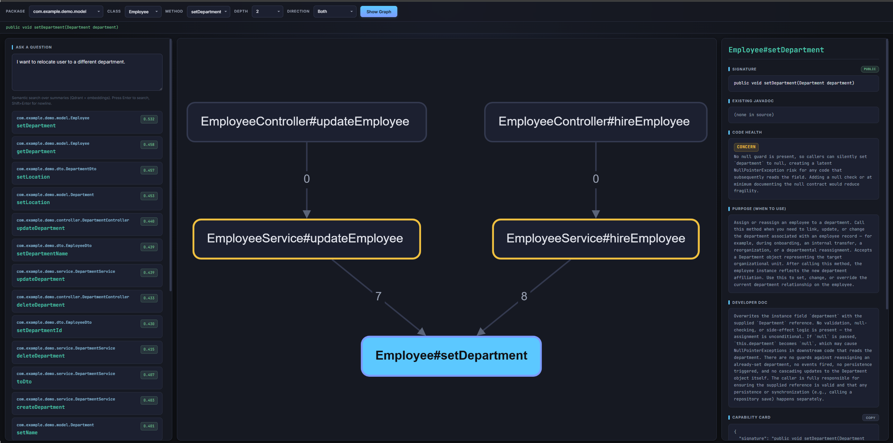

# mcp-function-registry

**A code intelligence tool that parses your codebase, builds a call graph, and uses LLM to generate semantic search, method summaries, capability cards for AI agents, and code health assessments.**

## Why

**For AI coding agents:** today's agents navigate codebases through grep, file reads, and
brute-force context stuffing. This works on small projects but breaks down on large
codebases — grep finds syntax matches, not behavioral ones, and dumping thousands of files
into a prompt is wasteful and imprecise. An agent should be able to ask *"which method
creates an invoice from a cart?"* and get a structured, ranked answer in milliseconds.
That requires the index to be **pre-computed, call-chain-aware, and stored as a graph +
vector space**, not re-derived from raw source on every turn. This project builds that
index and exposes it via MCP.

**For developers:** javadoc rots. Teams write it once and never update it, or skip it
entirely. Finding the right method in a large codebase becomes a game of guessing symbol
names and reading through implementation details. This tool generates accurate,
always-regenerable method documentation directly from the code — purpose summaries for
discovery, behavioral docs for understanding, and code health assessments for
maintainability. No manual upkeep required: re-run the pipeline after any change and the
documentation reflects the current state of the code.

---

`mcp-function-registry` parses a codebase, resolves method calls into a full call graph,
and optionally uses an LLM to generate rich documentation and assessments for every method.
Results are stored in Neo4j (graph) and Qdrant (vector search) and explored via a built-in
UI. The registry is language-agnostic by design; the current parser backend targets Java,
with additional language backends on the roadmap.

---


<p align="center">
  <br>
  <em>Call graph with method detail panel — signature, javadoc, code health, purpose summary</em><br>
  
  <br><br>
  <em>Scrolled detail panel — developer doc and capability card</em><br>
  
  <br><br>
  <em>Callers tree — which code paths lead to Employee#setDepartment</em><br>
  
</p>

---

## Use cases

### Semantic search over methods
Build a searchable index of your codebase. Each method gets a **purpose summary** —
a business-oriented description optimized for vector search. Ask natural-language questions
like *"which method hires a new employee?"* and get ranked results in milliseconds,
instead of grepping for symbol names.

### Call-chain-aware method summaries
Generate **developer documentation** that reflects not just the method body but what its
callees actually do. Methods are summarized in topological order (leaves first), so each
summary builds on already-generated callee context. The result is far more accurate than
per-method-in-isolation prompting.

### Capability cards for AI coding agents
For public methods, generate a structured **capability card** — a local contract that tells
an AI agent everything it needs to decide whether to call this method and how to call it
correctly: purpose, parameter descriptions, preconditions, return value, exceptions, and
side effects. Structural fields (signature, parameter names/types) are deterministic from
the AST; the LLM contributes only descriptions.

### Code health assessment
Every method receives a lightweight **code health rating** (OK / CONCERN / SMELL) with a
short explanation. The LLM catches things static analysis often misses: mixed responsibilities,
misleading names vs actual behavior, dead code, silent error swallowing, deeply nested
control flow.

### MCP server for AI coding agents
The ultimate goal: expose the registry as an **MCP (Model Context Protocol) server** so
coding agents can query it natively. An agent working on your codebase can discover
existing methods via semantic search, retrieve capability cards to understand how to call
them, and navigate the call graph — all without stuffing raw source into its context window.
The MCP server is under active development.

### Call graph exploration
Even without LLM calls, the tool builds a full call graph stored in Neo4j. Explore which
methods call which, find entry points, trace call chains, and understand the structure of
an unfamiliar codebase through the built-in graph UI.

---

## What it does

```
Source code
    │
    ▼
┌───────────────────────────────────────────────────────────────┐
│ 1. Parse (JavaParser + SymbolSolver, or LSP)                  │
│    Resolve every method call to a fully qualified signature.  │
│    Build MethodInfo records with callees, visibility, body,   │
│    existing javadoc, signature, parameters.                   │
└───────────────────────────────────────────────────────────────┘
    │
    ▼
┌───────────────────────────────────────────────────────────────┐
│ 2. Topologically sort the call graph (Kahn's algorithm)       │
│    Leaves first, callers after callees. Cycles broken by      │
│    placing cycle members at the front with best-effort        │
│    context.                                                   │
└───────────────────────────────────────────────────────────────┘
    │
    ▼
┌───────────────────────────────────────────────────────────────┐
│ 3. LLM phase (Claude)                                         │
│    For each method in topological order, prompt includes the  │
│    body + already-generated purpose summaries of its callees. │
│    The LLM returns:                                           │
│      - purposeSummary    (business-oriented, for embeddings)  │
│      - developerDoc      (call-chain-aware behavioral summary)│
│      - capabilityCard    (structured contract, public only)   │
│      - codeHealth        (OK / CONCERN / SMELL + explanation) │
│    Structural fields (signature, parameter names/types) are   │
│    deterministic from the AST; the LLM contributes only       │
│    descriptions.                                              │
└───────────────────────────────────────────────────────────────┘
    │
    ▼
┌───────────────────────────────────────────────────────────────┐
│ 4. Store                                                      │
│    Neo4j : (:Method)-[:CALLS {order}]->(:Method) with full    │
│            metadata on the node.                              │
│    Qdrant: one point per method, embedded via OpenAI          │
│            text-embedding-3-small using the purposeSummary.   │
└───────────────────────────────────────────────────────────────┘
```

### Method identity

Every method has a globally unique coordinate:

```
namespace::language:fully.qualified.Class.method(ParamTypes)
```

Example: `demo-app::java:com.example.demo.service.EmployeeService.hireEmployee(com.example.demo.dto.EmployeeDto)`

`MethodCoordinate` gives you `globalId()` (used as the Neo4j node key) and
`deterministicUuid()` (UUID5 of the globalId, used as the Qdrant point ID). Multiple
projects coexist in the same databases; queries filter by `namespace` to scope,
or search across all.

### Capability cards

For **public methods only**, the pipeline produces a structured capability card:

```json
{
  "signature": "public EmployeeDto hireEmployee(EmployeeDto dto)",
  "summary": "Hire a new employee, optionally assigning them to a department...",
  "parameters": [
    { "name": "dto", "type": "EmployeeDto", "description": "Employee data including name, email, salary..." }
  ],
  "preconditions": "Email must be unique across all employees...",
  "returns": "The persisted EmployeeDto with generated ID...",
  "throws": "IllegalArgumentException if email is already registered...",
  "sideEffects": "Persists a new Employee entity to the database..."
}
```

This is a **code-level contract**, not a runtime tool registration. An AI agent reads it
to decide whether and how to call the method from code it is writing.

---

## Tech stack

| Concern        | Choice                                                     |
|----------------|------------------------------------------------------------|
| Parsing        | `javaparser-symbol-solver-core` 3.26.2, or any LSP server  |
| LLM            | Anthropic Claude (claude-sonnet-4-6) via OkHttp            |
| Embeddings     | OpenAI `text-embedding-3-small` via OkHttp                 |
| Graph DB       | Neo4j Community 5.21 (no auth, local dev)                  |
| Vector DB      | Qdrant 1.9.1                                               |
| Build          | Maven, Java 17                                             |
| Config         | `dotenv-java` + `application.properties`                   |
| UI             | Node.js + Express + Cytoscape.js (dagre layout)            |
| Infra          | Docker Compose                                             |

---

## Quick start

### Prerequisites

- Java 17+, Maven
- Docker Desktop (for Neo4j + Qdrant)
- Node.js (for the UI)
- API keys in a `.env` file — only needed for the full pipeline

```bash
# .env
ANTHROPIC_API_KEY=sk-ant-...
OPENAI_API_KEY=sk-...
```

### 1. Start databases

```bash
docker compose up -d
```

- Neo4j browser: http://localhost:7474 (no auth)
- Qdrant dashboard: http://localhost:6333/dashboard

### 2. Build

```bash
mvn package -DskipTests
```

### 3. Run the pipeline

Graph-only — no API keys needed, just parse + store the call graph:

```bash
java -jar target/mcp-function-registry-1.0.0-SNAPSHOT.jar \
  my-repo ./src/main/java
```

Full pipeline — parse + LLM summaries + embeddings:

```bash
java -jar target/mcp-function-registry-1.0.0-SNAPSHOT.jar \
  my-repo ./src/main/java --with-summary --with-embeddings
```

CLI shape: `<namespace> <source-root> [--with-summary] [--with-embeddings] [--lsp]`

### LSP mode

By default, the parser uses JavaParser with SymbolSolver for Java sources. For other
languages — or when JavaParser cannot resolve symbols in your project — you can use
an LSP server instead. Add the `--lsp` flag and configure the following properties
in `.env` or `application.properties`:

| Property | Required | Description |
|----------|----------|-------------|
| `lsp.server.command` | yes | Command to start the LSP server (e.g. `jdtls` or `typescript-language-server --stdio`) |
| `lsp.language.id` | no | Language identifier sent to the server (default: `java`) |
| `lsp.file.extension` | no | File extension to scan (default: `.java`) |
| `lsp.workspace.dir` | no | Workspace root override; if unset, auto-detected by walking up to `pom.xml` / `build.gradle` |
| `lsp.ready.timeout.ms` | no | How long to wait for the LSP server to initialize (default: `180000`) |

Example for Java with Eclipse JDT Language Server:

```properties
lsp.server.command=jdtls
lsp.language.id=java
lsp.file.extension=.java
```

Example for TypeScript:

```properties
lsp.server.command=typescript-language-server --stdio
lsp.language.id=typescript
lsp.file.extension=.ts
```

The LSP backend extracts the same method information as JavaParser (signatures, call
hierarchies, bodies) but works with any language that has an LSP server supporting
`textDocument/documentSymbol` and `callHierarchy/incomingCalls`.

### 4. Explore

```bash
cd ui && npm install && node server.js
```

Open http://localhost:3000 — filter by package / class / method, click **Show Graph**,
click nodes for the full detail panel (purpose summary, developer doc, capability card,
code health, call-graph edges). Semantic search and fulltext search are available in the
sidebar.

### Example Cypher

```cypher
// Entry points — methods nobody calls
MATCH (m:Method) WHERE NOT ()-[:CALLS]->(m)
RETURN m.className, m.methodName;

// Call composition for a given method
MATCH path = (m:Method {methodName: "hireEmployee"})-[:CALLS*]->(callee)
RETURN path;

// Upstream callers of a repository method
MATCH path = (caller)-[:CALLS*]->(m:Method {methodName: "upsertMethod"})
RETURN path;
```

---

## Design decisions worth flagging

1. **No source modification.** Nothing is written back into source files. All generated
   content lives only in Neo4j / Qdrant.
2. **Call-chain-aware summarization.** A caller's summary is generated *after* its
   callees, with those callees' purpose summaries as context. This produces far more
   accurate behavior descriptions than per-method-in-isolation prompting.
3. **Two-summary design.** `purposeSummary` is business-oriented and used for vector
   embeddings (semantic search). `developerDoc` is a behavioral walkthrough for humans.
   They serve different audiences and must not be conflated — technical summaries
   cluster in vector space, making semantic search useless.
4. **Hybrid capability card generation.** Structural fields (signature, parameter
   names/types) are deterministic from the AST. The LLM contributes only descriptions.
   It cannot invent, drop, or rename parameters.
5. **Public-only capability cards.** Private / protected / package-private methods
   still get parsed, still enter the call graph, still get summaries and code health
   ratings — they just have `capabilityCard = null`.
6. **Graph-only mode.** The default (without `--with-*` flags) skips all LLM and
   embedding calls. Useful for quick call-graph exploration or CI runs without API keys.
7. **Multi-namespace aware.** Coordinates are `namespace::language:qualifiedSignature`.
   Multiple projects share the same Neo4j + Qdrant stores.

---

## Roadmap

- [ ] **LangChain4j port** — replace the hand-rolled Anthropic / OpenAI / Qdrant
  clients with LangChain4j abstractions to cut boilerplate and gain swappable model
  backends.
- [ ] **MCP server** — expose the registry over the Model Context Protocol so
  coding agents can query it natively.
- [ ] **Language-agnostic parsing** — move from JavaParser-specific extraction to a
  thin LSP-proxy frontend, so the same registry structure works for TypeScript, Go,
  Python, etc. (LSP preferred over tree-sitter because LSP gives resolved symbols,
  not just a parse tree.)
- [ ] **Incremental re-indexing.** Bodies are already hashed (SHA-256); the delta
  pipeline isn't wired up yet.
- [ ] **Schema versioning** for Neo4j / Qdrant payloads.

---

## Project layout

```
src/main/java/com/github/gabert/llm/mcp/ldoc/
  core/        Main, AppConfig, AnalysisPipeline (phase orchestration)
  parser/      MethodExtractor (JavaParser + symbol solver)
  lsp/         LspClient, LspMethodExtractor (LSP-based extraction)
  graph/       TopologicalSorter (Kahn's algorithm, cycle-aware)
  llm/         ClaudeClient, PromptBuilder, SummaryParser
  storage/     Neo4jGraphStore, QdrantVectorStore, OpenAiEmbeddingClient
  model/       MethodCoordinate, MethodInfo, CapabilityCard, ParameterInfo, Visibility
ui/            Node.js Express server + Cytoscape.js frontend
docker-compose.yml
pom.xml
```

---

## Status

Early, actively developed, single-maintainer. The pipeline is working end-to-end
(parse → summarise → Neo4j + Qdrant → UI) and has been validated against a small
Spring Boot demo application (~100 methods). Interfaces are **not** stable — expect
breaking changes as the MCP and multi-language work lands.

Good entry points for reading the code:

- `core/AnalysisPipeline.java` — end-to-end phase orchestration
- `parser/MethodExtractor.java` — how call resolution actually happens
- `llm/PromptBuilder.java` — the LLM prompt that produces all artifacts
- `graph/TopologicalSorter.java` — cycle handling for mutually recursive methods